# Backup DB

## 1. Login GCP and Open Cloud SQL (PostgreSQL)

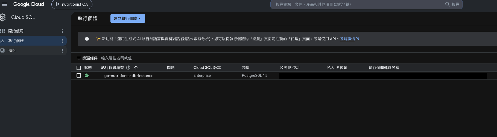

## 2. Click the instance and click export

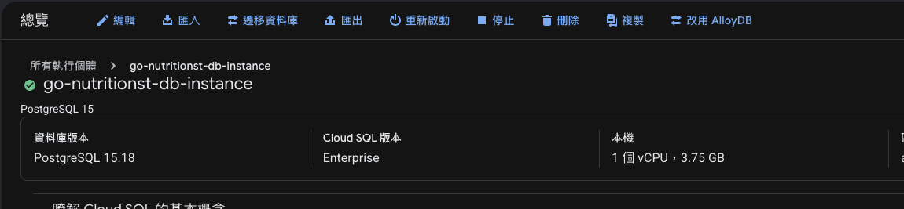

## 3. Choose the export format (SQL)

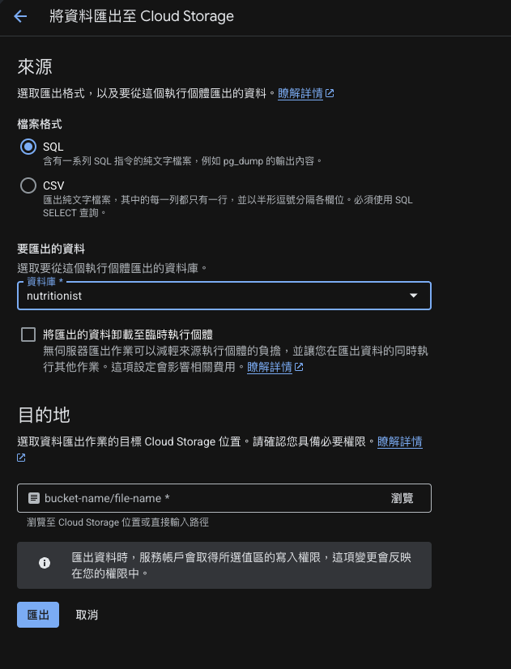

## 4. Setup the Cloud Storage

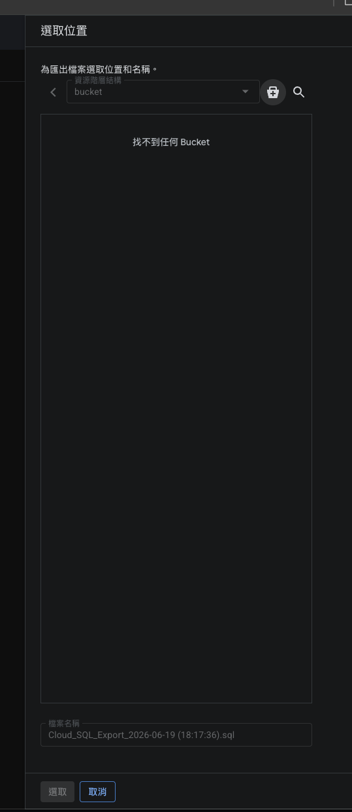
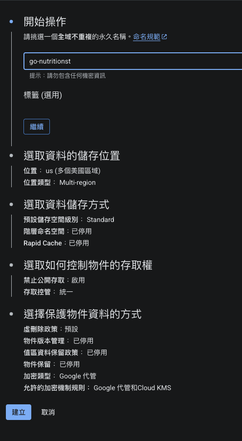
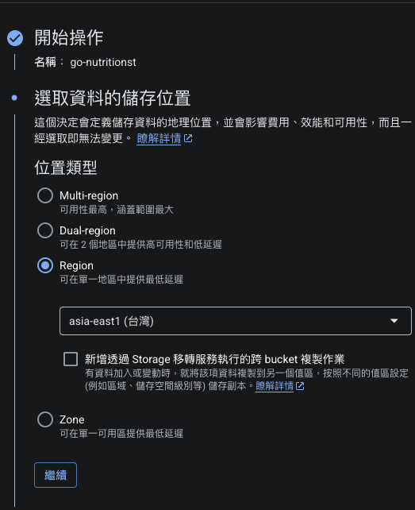
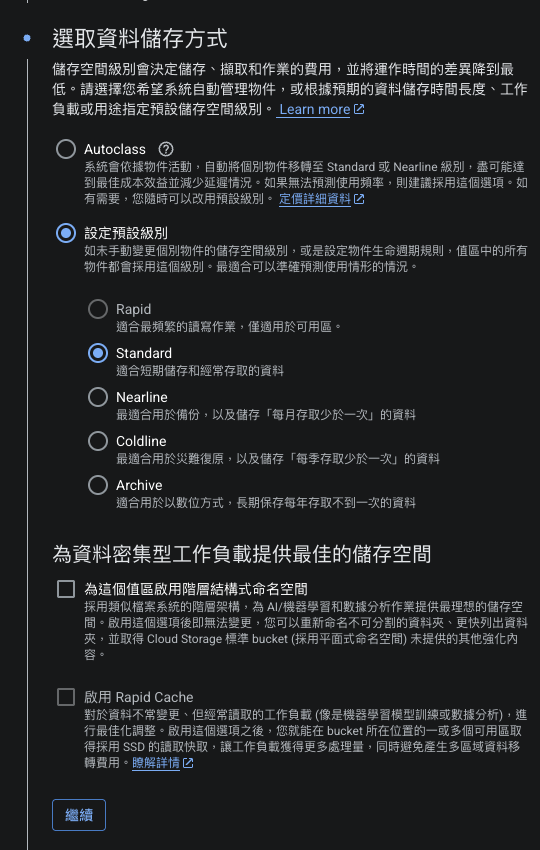
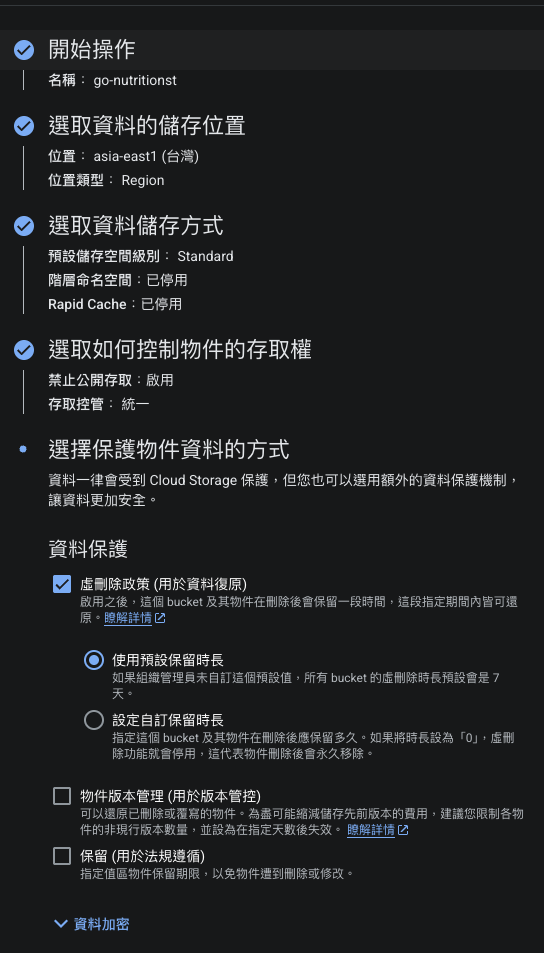
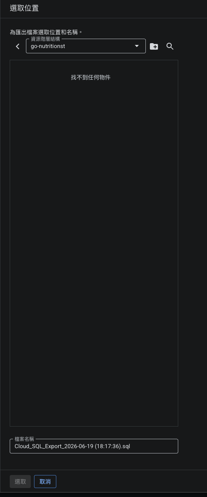

## 5. Click export

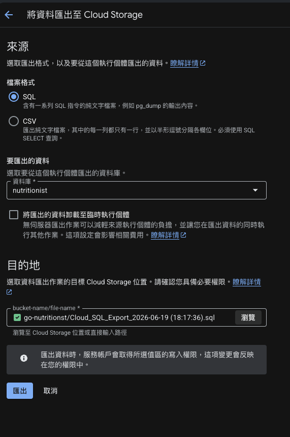

## 6. Wait the export complete and Go to Cloud Storage

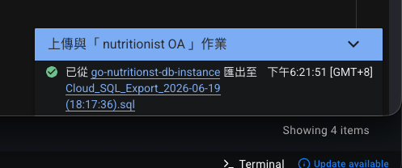

## 7. Download sql file from Cloud Storage

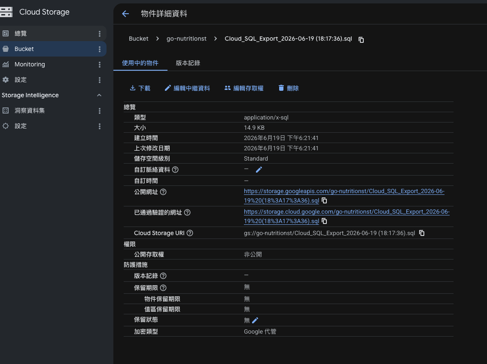

