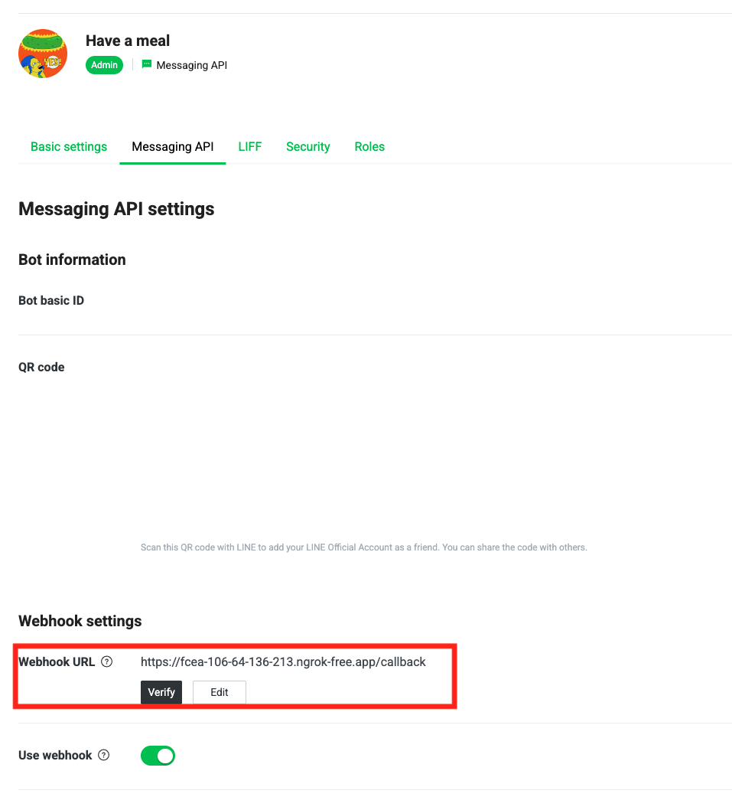

# Deploy Services

## 1. Prerequisites

- Install [Docker Desktop](https://docs.docker.com/desktop/)
- Install [Google Cloud SDK (gcloud CLI)](https://cloud.google.com/sdk/docs/install).
- Run the [build-images.md](./build-images.md) and [upload-images.md](./upload-images.md) to upload images first.

---

## 2. Prepare Terraform Variables

- Create a terraform.tfvars file in the ./deployment/infra/directory and add the following variables:

| variable             | description                                         | default                          |
| -------------------- | --------------------------------------------------- | -------------------------------- |
| region               | The region where resources will be deployed.        | asia-east1                       |
| registry_host        | The hostname of image registry                      | asia-east1-docker.pkg.dev        |
| project_id           | The GCP project ID.                                 |                                  |
| image_name           | The docker image name.                              | fastapi-app-bot                  |
| openai_api_key       | The OpenAI API Key                                  |                                  |
| channel_secret       | The Line OA channel Secret                          |                                  |
| channel_access_token | The Line OA channel access token                    |                                  |
| max_daily_token      | The max daily token                                 | 120000                           |
| db_tier              | Machine type for the Cloud SQL instance.            | db-custom-1-3840                 |
| edition              | The edition of the Cloud SQL instance               | ENTERPRISE                       |
| db_user              | The Cloud SQL database username                     |                                  |
| db_pwd               | The Cloud SQL database password                     |                                  |
| db_name              | Cloud SQL database name                             |                                  |
| push_msg_image_name  | The docker image name for the push message service. | fastapi-app-push-msg             |
| morning_msg          | The afternoon pushing message content               | 早安！記得紀錄今日飲食唷～       |
| evening_msg          | The evening pushing message content                 | 晚安！別忘了確認今日的營養目標！ |
| breakfast_msg        | The breakfast pushing message content               | 早安！記得紀錄今日飲食唷～       |
| lunch_msg            | The lunch pushing message content                   | 午安！記得紀錄今日飲食唷～       |
| dinner_msg           | The dinner pushing message content                  | 晚安！別忘了確認今日的營養目標！ |
| morning_schedule     | Cron schedule for the morning message               | 0 9 * * *                        |
| evening_schedule     | Cron schedule for the evening message               | 0 20 * * *                       |
| breakfast_schedule   | Cron schedule for the breakfast message             | 0 10 * * *                       |
| lunch_schedule       | Cron schedule for the lunch message                 | 0 13 * * *                       |
| dinner_schedule      | Cron schedule for the dinner message                | 0 19 * * *                       |

In `terraform.tfvars`, add the following variables:

```hcl
region               = "asia-east1"
registry_host        = "asia-east1-docker.pkg.dev"
project_id           = ""
image_name           = "fastapi-app-bot"
openai_api_key       = ""
channel_access_token = ""
channel_secret       = ""
db_tier              = "db-custom-1-3840"
db_user              = ""
db_pwd               = ""
db_name              = ""
max_daily_token      = "500000"
push_msg_image_name  = "fastapi-app-push-msg"
morning_msg          = "早安！記得紀錄今日睡眠與體重"
evening_msg          = "晚安！別忘了紀錄今日的飲水量與查看每日飲食報告！"
breakfast_msg        = "早安！記得紀錄今日早餐唷～"
lunch_msg            = "午安！記得紀錄今日午餐唷～"
dinner_msg           = "晚安！記得紀錄今日晚餐唷～"
morning_schedule     = "0 9 * * *"
evening_schedule     = "0 20 * * *"
breakfast_schedule   = "0 10 * * *"
lunch_schedule       = "0 13 * * *"
dinner_schedule      = "0 19 * * *"
```

## 3. Run Deploy

### Option A: Deploy via Docker (Recommended, no local Terraform/gcloud CLI installation needed)

Before deploying, make sure you have generated Application Default Credentials on your local host machine:

```bash
gcloud auth application-default login
```

Then, run the deployment using the Makefile target:

```bash
make deploy-docker
```

Or run Docker commands directly:

- **macOS/Linux**:
  ```bash
  # Build deploy image
  docker build -t deploy-app -f ./deployment/infra/deploy.Dockerfile .

  # Run deployment
  docker run --rm \
    -v ~/.config/gcloud:/root/.config/gcloud \
    -v $(pwd):/workspace \
    deploy-app sh -c "terraform init && terraform apply -var-file=terraform.tfvars -var service_name=go-nutritionst -auto-approve"
  ```

- **Windows (PowerShell)**:
  ```powershell
  # Build deploy image
  docker build -t deploy-app -f ./deployment/infra/deploy.Dockerfile .

  # Run deployment
  docker run --rm `
    -v ${HOME}/.config/gcloud:/root/.config/gcloud `
    -v ${PWD}:/workspace `
    deploy-app sh -c "terraform init && terraform apply -var-file=terraform.tfvars -var service_name=go-nutritionst -auto-approve"
  ```

### Option B: Local Deploy (Requires local Terraform & gcloud CLI)

1. Login Google Cloud:
   ```bash
   gcloud auth login
   ```

2. Run Deploy:
   ```bash
   make deploy
   ```

- After deployment, you will get the public ip from terraform output. e.g. `cloud_run_service_url = "https://go-nutritionst-dbq2cf7oua-de.a.run.app"`

## 4. Line OA Configuration

1. Set Webhook URL
   - Example: `https://[IP_ADDRESS]/callback`
   

